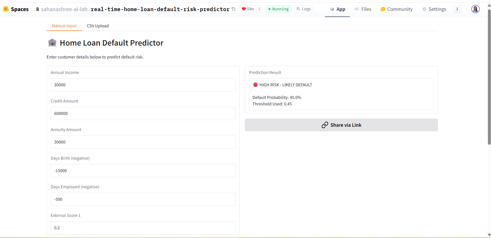
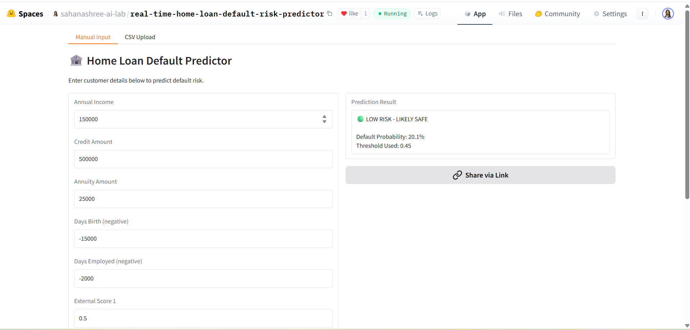
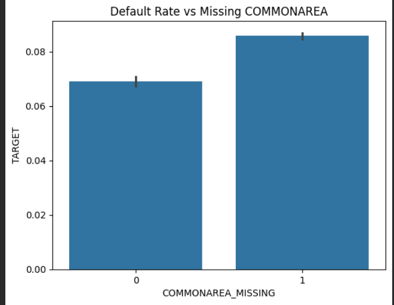
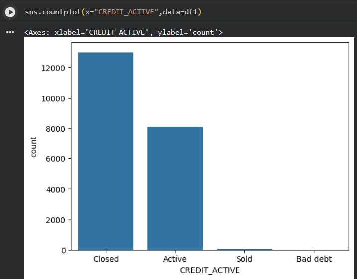

# 🏠 Home Loan Default Risk Predictor


A machine learning project to predict whether a home loan applicant is likely to **default**, built using XGBoost on the Home Credit dataset — with a real-time web app deployed on Hugging Face Spaces.

---

## 🚀 Live Demo

👉 [Try it on Hugging Face Spaces](https://huggingface.co/spaces/sahanashree-ai-lab/real-time-home-loan-default-risk-predictor)

### High Risk Prediction


### Low Risk Prediction


---

## 📌 Problem Statement

Some customers fail to repay home loans (**default**), causing significant losses to banks. Home loans are large and long-term, making it critical to identify risky applicants before approving loans.

This project uses historical customer data, past loan behavior, and repayment patterns to predict default risk in real time.

---

## 📁 Datasets Used

| Dataset | Purpose |
|--------|---------|
| `application_train.csv` | Main data with customer info and Target (1=Defaulter, 0=Non-Defaulter) |
| `bureau.csv` | Previous loans from other banks |
| `bureau_balance.csv` | Monthly history of previous loans from bureau |
| `POS_CASH_balance.csv` | Monthly history of POS & cash loans |
| `credit_card_balance.csv` | Monthly history of credit card usage |
| `previous_application.csv` | Past loan applications |
| `installments_payments.csv` | Payment history of previous loans |

> Dataset source: [Home Credit Default Risk – Kaggle](https://www.kaggle.com/c/home-credit-default-risk)

---

## 📊 Exploratory Data Analysis

**Default Rate by Missing COMMONAREA**

> Customers with missing COMMONAREA data show ~8.6% default rate vs ~6.9% for those with data — suggesting missingness itself is a meaningful risk signal.

**Credit Active Status Distribution**

> Most bureau records are Closed (~13k) or Active (~8k), with very few Sold or Bad debt entries.

---

## 🧠 Modeling Approach

### Class Imbalance
The dataset was highly imbalanced:
- Class 0 (Non-default): 56,538
- Class 1 (Default): 4,965
- Default rate ≈ 8%

Handled using `scale_pos_weight ≈ 11.38` in XGBoost.

### Model Comparison

| Model | ROC-AUC |
|-------|---------|
| Logistic Regression (Baseline) | 0.74 |
| XGBoost (Initial) | 0.76 |
| XGBoost (Tuned) | **0.761** |

### Threshold Tuning

| Threshold | Recall (Class 1) | Precision (Class 1) | Accuracy |
|-----------|-----------------|---------------------|----------|
| 0.40 | 0.82 | 0.14 | 0.57 |
| 0.45 | 0.75 | 0.15 | 0.64 |
| 0.50 | 0.68 | 0.17 | 0.70 |

✅ Final threshold selected: **0.45** (prioritizing recall to minimize missed defaulters)

### Final Hyperparameters

```python
XGBClassifier(
    max_depth=4,
    learning_rate=0.05,
    n_estimators=400,
    scale_pos_weight=11.38
)
```

---

## 🏆 Final Results

- **ROC-AUC: 0.761**
- Strong recall for minority class (defaulters)
- XGBoost outperformed Logistic Regression baseline

---

## 🛠️ Tech Stack

| Tool | Purpose |
|------|---------|
| Python | Core language |
| Pandas, NumPy | Data processing |
| Scikit-learn | Preprocessing, metrics |
| XGBoost | Final model |
| Matplotlib, Seaborn | EDA visualizations |
| Joblib | Model serialization |
| Gradio | Web app interface |
| Hugging Face Spaces | Deployment |

---

## 📂 Project Structure

```
home-loan-default-risk-predictor/
│
├── notebooks/
│   └── Home_Loan_Default_Risk_Management.ipynb
├── models/
│   ├── home_credit_xgboost.pkl
│   └── decision_threshold.pkl
├── src/
│   └── app.py
├── screenshots/
│   ├── app_high_risk_prediction.png
│   ├── app_low_risk_prediction.png
│   ├── eda_default_rate_commonarea.png
│   └── eda_credit_active_distribution.png
├── README.md
├── requirements.txt
└── .gitignore
```

---

## ⚙️ Installation & Run Locally

```bash
git clone https://github.com/YOUR_USERNAME/home-loan-default-risk-predictor.git
cd home-loan-default-risk-predictor
pip install -r requirements.txt
python src/app.py
```

---

## ✅ Conclusion

- XGBoost significantly outperformed the Logistic Regression baseline
- Handling class imbalance improved minority class detection
- Threshold tuning aligned the model with real-world banking objectives
- The deployed app allows real-time prediction for any customer profile
